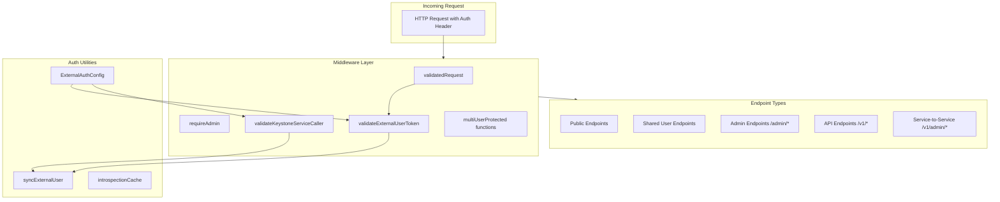

# Authentication & Middleware Architecture Reference

> **Purpose**: This document describes the authentication and middleware protection architecture for the AnythingLLM server codebase, designed to help an LLM understand how to make changes to auth sections and middleware protections.

---

## Table of Contents

1. [High-Level Architecture](#high-level-architecture)
2. [Authentication Modes](#authentication-modes)
3. [Middleware Files & Functions](#middleware-files--functions)
4. [Auth Utilities](#auth-utilities)
5. [Endpoint Protection Patterns](#endpoint-protection-patterns)
6. [Database Schema (Users)](#database-schema-users)
7. [Environment Variables](#environment-variables)
8. [Decision Tree for Choosing Middleware](#decision-tree-for-choosing-middleware)
9. [Common Modification Scenarios](#common-modification-scenarios)

---

## High-Level Architecture



---

## Authentication Modes

### 1. Single-User Mode
- **No multi-user database tables used**
- Password set via `AUTH_TOKEN` environment variable
- JWT contains encrypted password (`{ p: encrypted_password }`)
- Everyone with valid token has admin access

### 2. Multi-User Mode
- Users stored in `users` table with roles ([admin](file:///Users/joelmartinez/anything-LayerOne-LLM/server/endpoints/admin.js#24-549), `manager`, `default`)
- JWT contains user info (`{ id, username, role }`)
- Role-based access control (RBAC) applied

### 3. External Auth (Keystone Integration)
- Enabled via `EXTERNAL_AUTH_ENABLED=true`
- Uses OAuth 2.0 token introspection (RFC 7662)
- External users mapped to local `users` table via `externalId` + `externalProvider`
- External users ALWAYS get `default` role (never admin)

### 4. Service-to-Service Auth (Keystone Service Actor)
- For `/v1/admin/*` API endpoints
- Validates GCP OIDC tokens or local RS256 JWTs
- Creates system actor user with [admin](file:///Users/joelmartinez/anything-LayerOne-LLM/server/endpoints/admin.js#24-549) role
- Sets `response.locals.systemActor = true`

---

## Middleware Files & Functions

### Primary Middleware Files

| File | Location | Purpose |
|------|----------|---------|
| [validatedRequest.js](file:///Users/joelmartinez/anything-LayerOne-LLM/server/utils/middleware/validatedRequest.js) | `server/utils/middleware/` | Main auth gateway for user endpoints |
| `requireAdmin.js` | `server/utils/middleware/` | Admin-only access via API keys |
| `validateExternalUserToken.js` | `server/utils/middleware/` | Keystone user JWT validation |
| `validateKeystoneServiceCaller.js` | `server/utils/middleware/` | Service-to-service identity verification |
| `multiUserProtected.js` | `server/utils/middleware/` | Role-based access control helpers |
| `requireAdminJWT.js` | `server/utils/middleware/` | Admin JWT validation (internal) |

---

### Middleware Function Reference

#### `validatedRequest(request, response, next)`
**File**: [validatedRequest.js](file:///Users/joelmartinez/anything-LayerOne-LLM/server/utils/middleware/validatedRequest.js)

**Flow**:
```
1. Check if EXTERNAL_AUTH_ENABLED && multiUserMode
   ├─ YES: Try internal admin JWT first
   │       ├─ Valid admin JWT → next()
   │       └─ Not admin JWT → validateExternalUserToken()
   └─ NO: Continue to internal auth

2. If multiUserMode only → validateMultiUserRequest()

3. If single-user mode:
   ├─ Development or no AUTH_TOKEN → passthrough
   └─ Validate JWT with encrypted password
```

**Use**: Shared/user-facing endpoints that need authentication

---

#### `requireAdmin(request, response, next)`
**File**: [requireAdmin.js](file:///Users/joelmartinez/anything-LayerOne-LLM/server/utils/middleware/requireAdmin.js)

**Flow**:
```
1. Extract Bearer token from Authorization header

2. If multiUserMode:
   ├─ Validate token as API key (from api_keys table)
   ├─ Lookup user who created API key
   ├─ Verify user.role === "admin"
   └─ Attach user to request.user

3. If single-user mode:
   ├─ Development → passthrough with admin role
   └─ Validate JWT with encrypted AUTH_TOKEN
```

**Use**: Admin endpoints (`/admin/*`) that require API key authentication

**Important**: Does NOT accept external JWTs - only API keys in multi-user mode

---

#### `validateExternalUserToken(req, res, next)`
**File**: [validateExternalUserToken.js](file:///Users/joelmartinez/anything-LayerOne-LLM/server/utils/middleware/validateExternalUserToken.js)

**Flow**:
```
1. Check if EXTERNAL_AUTH enabled

2. Require multi-user mode

3. Extract Bearer token

4. Light structural check (decode JWT payload without verification)

5. Check token expiration locally

6. Call Keystone introspection endpoint (cached 30s)

7. Validate introspection response claims:
   - active, sub, role, scope, aud, iss, exp, iat

8. Sync external user to local database

9. Attach to response.locals:
   - user (local user record)
   - externalUser (Keystone identity)
   - scope (parsed scopes array)

10. Audit log the auth event
```

**Use**: Called by `validatedRequest` when external auth is enabled

---

#### `validateKeystoneServiceCaller(request, response, next)`
**File**: [validateKeystoneServiceCaller.js](file:///Users/joelmartinez/anything-LayerOne-LLM/server/utils/middleware/validateKeystoneServiceCaller.js)

**Flow**:
```
1. Extract Bearer token

2. Based on ANYTHINGLLM_SERVICE_AUTH_MODE:
   ├─ "gcp": Verify Google OIDC ID token
   │         - Check audience, caller email
   └─ "local_jwt": Verify RS256 JWT
                   - Check iss, sub, aud, role claims

3. Sync Keystone service actor user (gets admin role)

4. Set response.locals:
   - user (service actor user)
   - systemActor = true  ← CRITICAL FLAG
   - scope
   - multiUserMode

5. Audit log
```

**Use**: All `/v1/admin/*` API endpoints

**Critical**: When `systemActor = true`, do NOT check end-user roles

---

#### Role-Based Access (multiUserProtected.js)
**File**: [multiUserProtected.js](file:///Users/joelmartinez/anything-LayerOne-LLM/server/utils/middleware/multiUserProtected.js)

**Constants**:
```javascript
const ROLES = {
  all: "<all>",      // Anyone can access
  admin: "admin",    // Admin only
  manager: "manager", // Manager role
  default: "default" // Default user role
};
```

**Functions**:

| Function | Description |
|----------|-------------|
| `strictMultiUserRoleValid(allowedRoles)` | Requires multi-user mode + matching role |
| `flexUserRoleValid(allowedRoles)` | Checks role only if in multi-user mode |
| `isMultiUserSetup()` | Verifies multi-user mode is enabled |

**Usage Example**:
```javascript
app.get("/endpoint", [
  validatedRequest,
  flexUserRoleValid([ROLES.admin, ROLES.manager])
], handler);
```

---

## Auth Utilities

### ExternalAuthConfig
**File**: [config.js](file:///Users/joelmartinez/anything-LayerOne-LLM/server/utils/auth/config.js)

```javascript
const ExternalAuthConfig = {
  enabled: process.env.EXTERNAL_AUTH_ENABLED === "true",
  mode: process.env.EXTERNAL_AUTH_MODE || "introspect",
  baseUrl: process.env.EXTERNAL_AUTH_API_URL,
  introspectionUrl: `${baseUrl}/api/v1/auth/introspect`,
  issuer: process.env.EXTERNAL_AUTH_ISSUER,
  audience: process.env.EXTERNAL_AUTH_AUDIENCE,
  serviceKey: process.env.EXTERNAL_API_SERVICE_KEY,
  cacheTTL: parseInt(process.env.EXTERNAL_AUTH_INTROSPECTION_CACHE_TTL || "30"),
  requireHTTPS: process.env.NODE_ENV === "production"
};
```

---

### syncExternalUser
**File**: [syncExternalUser.js](file:///Users/joelmartinez/anything-LayerOne-LLM/server/utils/auth/syncExternalUser.js)

**Purpose**: Maps external user identity to local database record

```javascript
// Lookup by externalId + externalProvider
let user = await prisma.users.findFirst({
  where: {
    externalId: String(externalId),
    externalProvider: "keystone-core-api"
  }
});

// Create if not exists
if (!user) {
  user = await prisma.users.create({
    data: {
      username: email.split("@")[0],
      password: "placeholder-hash",
      role: "default",  // ALWAYS default for external users
      externalId: externalId,
      externalProvider: "keystone-core-api"
    }
  });
}
```

**Key Functions**:
- `syncExternalUser(externalUser)` - For regular external users
- `syncKeystoneServiceActor()` - For service identity (gets admin role)

---

### HTTP Utilities
**File**: [http/index.js](file:///Users/joelmartinez/anything-LayerOne-LLM/server/utils/http/index.js)

| Function | Purpose |
|----------|---------|
| `makeJWT(info, expiry)` | Create JWT signed with `JWT_SECRET` |
| `decodeJWT(token)` | Verify and decode JWT |
| `userFromSession(request, response)` | Get user from JWT or response.locals |
| `multiUserMode(response)` | Check if in multi-user mode |

---

## Endpoint Protection Patterns

### Pattern 1: Public Endpoints (No Auth)
```javascript
app.get("/ping", (_, response) => {
  response.status(200).json({ online: true });
});
```

### Pattern 2: Validated User Endpoints
```javascript
app.get("/system/check-token", [validatedRequest], handler);
```

### Pattern 3: Role-Restricted Endpoints
```javascript
app.get("/system/system-vectors", [
  validatedRequest,
  flexUserRoleValid([ROLES.admin, ROLES.manager])
], handler);
```

### Pattern 4: Admin-Only Endpoints (API Key)
```javascript
app.get("/admin/users", [requireAdmin], handler);
```

### Pattern 5: Service-to-Service Endpoints
```javascript
app.get("/v1/admin/users", [validateKeystoneServiceCaller], handler);
```

---

## Database Schema (Users)

**File**: [schema.prisma](file:///Users/joelmartinez/anything-LayerOne-LLM/server/prisma/schema.prisma)

```prisma
model users {
  id                Int       @id @default(autoincrement())
  username          String?   @unique
  password          String
  externalId        String?   // External user ID from Keystone
  externalProvider  String?   // "keystone-core-api" or "keystone"
  pfpFilename       String?
  role              String    @default("default")  // "admin", "manager", "default"
  suspended         Int       @default(0)
  // ... other fields

  @@index([externalId, externalProvider])
}
```

**User Model**:
**File**: [models/user.js](file:///Users/joelmartinez/anything-LayerOne-LLM/server/models/user.js)

---

## Environment Variables

### Core Auth
| Variable | Purpose |
|----------|---------|
| `AUTH_TOKEN` | Password for single-user mode |
| `JWT_SECRET` | Secret for signing/verifying JWTs |

### External Auth (Keystone)
| Variable | Purpose |
|----------|---------|
| `EXTERNAL_AUTH_ENABLED` | Enable external auth (`true`/`false`) |
| `EXTERNAL_AUTH_MODE` | Auth mode (`introspect`) |
| `EXTERNAL_AUTH_API_URL` | Keystone Core API base URL |
| `EXTERNAL_AUTH_ISSUER` | Expected JWT issuer |
| `EXTERNAL_AUTH_AUDIENCE` | Expected JWT audience |
| `EXTERNAL_API_SERVICE_KEY` | Service key for introspection |
| `EXTERNAL_AUTH_CACHE_TTL` | Introspection cache TTL (seconds) |

### Service Identity
| Variable | Purpose |
|----------|---------|
| `ANYTHINGLLM_SERVICE_AUTH_MODE` | `gcp` or `local_jwt` |
| `ANYTHINGLLM_SERVICE_AUDIENCE` | Expected audience for service tokens |
| `ANYTHINGLLM_ALLOWED_CALLER_SA_EMAIL` | Allowed GCP service account email |
| `KEYSTONE_SERVICE_PUBLIC_KEY` | Public key for local JWT verification |

---

## Decision Tree for Choosing Middleware

```
Is this a public endpoint (no auth needed)?
├─ YES → No middleware needed
└─ NO ↓

Is this a service-to-service API endpoint (/v1/admin/*)?
├─ YES → Use [validateKeystoneServiceCaller]
└─ NO ↓

Is this an admin-only endpoint (/admin/*)?
├─ YES → Use [requireAdmin]
└─ NO ↓

Does this need user authentication?
├─ YES → Use [validatedRequest]
│        Need role restriction?
│        ├─ YES → Add flexUserRoleValid([ROLES.xxx]) or strictMultiUserRoleValid()
│        └─ NO → Just [validatedRequest]
└─ NO → Check if multi-user setup matters
         └─ Use [isMultiUserSetup]
```

---

## Common Modification Scenarios

### Scenario 1: Add New Role-Protected Endpoint

```javascript
// In endpoints file
const { validatedRequest } = require("../utils/middleware/validatedRequest");
const { flexUserRoleValid, ROLES } = require("../utils/middleware/multiUserProtected");

app.get("/my-new-endpoint", [
  validatedRequest,
  flexUserRoleValid([ROLES.admin])  // Only admins
], async (request, response) => {
  // response.locals.user contains authenticated user
  // response.locals.multiUserMode indicates mode
});
```

### Scenario 2: Add New Admin API Endpoint

```javascript
// In endpoints/admin.js
const { requireAdmin } = require("../utils/middleware/requireAdmin");

app.post("/admin/new-feature", [requireAdmin], async (request, response) => {
  // request.user contains admin user
});
```

### Scenario 3: Add New Service-to-Service Endpoint

```javascript
// In endpoints/api/admin/index.js
const { validateKeystoneServiceCaller } = require("../../../utils/middleware/validateKeystoneServiceCaller");

app.post("/v1/admin/new-operation", [validateKeystoneServiceCaller], async (request, response) => {
  // response.locals.user contains service actor
  // response.locals.systemActor === true
});
```

### Scenario 4: Modify External User Sync Behavior

**File to modify**: [syncExternalUser.js](file:///Users/joelmartinez/anything-LayerOne-LLM/server/utils/auth/syncExternalUser.js)

```javascript
// Example: Add custom field mapping
const newUser = await prisma.users.create({
  data: {
    username: username,
    password: placeholderPassword,
    role: "default",
    externalId: String(externalId),
    externalProvider: "keystone-core-api",
    // Add new fields here
  }
});
```

### Scenario 5: Change Token Validation Logic

**Files to modify**:
- [validateExternalUserToken.js](file:///Users/joelmartinez/anything-LayerOne-LLM/server/utils/middleware/validateExternalUserToken.js) - For external user tokens
- [validatedRequest.js](file:///Users/joelmartinez/anything-LayerOne-LLM/server/utils/middleware/validatedRequest.js) - For internal tokens

### Scenario 6: Add New System Role

1. Add to ROLES constant in [multiUserProtected.js](file:///Users/joelmartinez/anything-LayerOne-LLM/server/utils/middleware/multiUserProtected.js)
2. Add validation in [user.js](file:///Users/joelmartinez/anything-LayerOne-LLM/server/models/user.js) `validations.role()`
3. Update middleware as needed

---

## Security Boundaries Summary

| Endpoint Type | API Keys | Admin JWT | External JWT | Service Token |
|--------------|----------|-----------|--------------|---------------|
| `/admin/*` | ✅ Accept | ❌ Reject | ❌ Reject | ❌ N/A |
| `/v1/admin/*` | ❌ Reject | ❌ Reject | ❌ Reject | ✅ Accept |
| Shared endpoints | ❌ Reject | ✅ Accept | ✅ Accept | ❌ N/A |

---

## Test Files Reference

| File | Purpose |
|------|---------|
| [auth.test.js](file:///Users/joelmartinez/anything-LayerOne-LLM/server/__tests__/middleware/auth.test.js) | Middleware unit tests |
| [auth.integration.test.js](file:///Users/joelmartinez/anything-LayerOne-LLM/server/__tests__/integration/auth.integration.test.js) | Integration tests |
| [auth.performance.test.js](file:///Users/joelmartinez/anything-LayerOne-LLM/server/__tests__/performance/auth.performance.test.js) | Performance tests |

---

## Key Files Quick Reference

| Category | File Path |
|----------|-----------|
| **Entry Point** | `server/index.js` |
| **Main Validated Auth** | `server/utils/middleware/validatedRequest.js` |
| **Admin Auth** | `server/utils/middleware/requireAdmin.js` |
| **External User Auth** | `server/utils/middleware/validateExternalUserToken.js` |
| **Service Auth** | `server/utils/middleware/validateKeystoneServiceCaller.js` |
| **Role Helpers** | `server/utils/middleware/multiUserProtected.js` |
| **Auth Config** | `server/utils/auth/config.js` |
| **User Sync** | `server/utils/auth/syncExternalUser.js` |
| **Cache** | `server/utils/auth/introspectionCache.js` |
| **JWT Utils** | `server/utils/http/index.js` |
| **User Model** | `server/models/user.js` |
| **Admin Endpoints** | `server/endpoints/admin.js` |
| **API Admin Endpoints** | `server/endpoints/api/admin/index.js` |
| **Prisma Schema** | `server/prisma/schema.prisma` |
