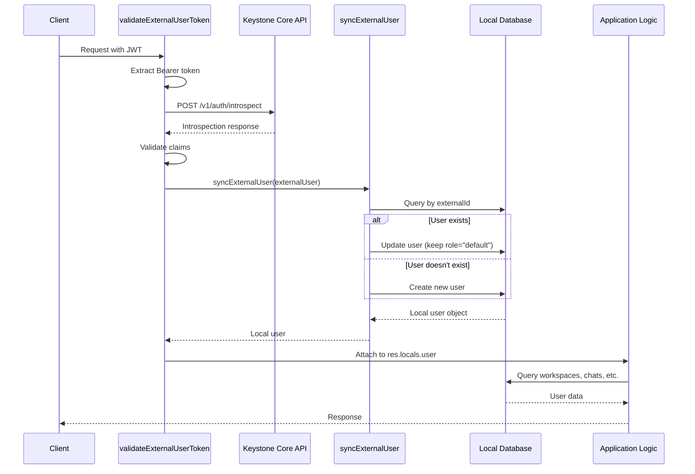

# External Authentication Architecture

## Overview

AnythingLLM supports external authentication via **Keystone Core API**, allowing users to authenticate with an external identity provider while maintaining local user records for workspace permissions, chat history, and audit logging.

This document explains how external users are connected to the local database and how the authentication flow works.

---

## User Connection Mechanism

### The Hybrid Approach

External authentication uses a **hybrid identity model** that maps external user identities to local database records:

```
External User (Keystone Core API)
         ↓
   Token Introspection
         ↓
   User Synchronization
         ↓
Local User Record (AnythingLLM Database)
         ↓
Workspaces, Chats, Permissions
```

### Database Schema

The `users` table contains two key fields for external authentication:

```prisma
model users {
  id                Int       @id @default(autoincrement())
  username          String?   @unique
  password          String    // Placeholder for external users
  externalId        String?   // External user ID from Keystone
  externalProvider  String?   // Always "keystone-core-api"
  role              String    @default("default")
  // ... other fields
  
  @@index([externalId, externalProvider])
}
```

**Key Fields:**
- `externalId`: Stores the `sub` claim from the Keystone JWT (the external user's unique ID)
- `externalProvider`: Set to `"keystone-core-api"` to identify the authentication provider
- `password`: Contains a placeholder hash (`"external-auth-only"`) that is never used for authentication

---

## Authentication Flow

### 1. Token Validation (`validateExternalUserToken.js`)

When an external user makes a request:

1. **Extract JWT**: Parse the `Authorization: Bearer <token>` header
2. **Introspect Token**: Call Keystone's `/v1/auth/introspect` endpoint (RFC 7662)
3. **Validate Claims**: Verify `active`, `sub`, `role`, `scope`, `aud`, `iss`, `exp`, `iat`
4. **Cache Result**: Store introspection response for 30 seconds (configurable via `EXTERNAL_AUTH_CACHE_TTL`)

**Introspection Response Example:**
```json
{
  "active": true,
  "sub": "12345",
  "role": { "id": 2, "name": "User" },
  "scope": "read write",
  "aud": "anythingllm",
  "iss": "keystone-core-api",
  "exp": 1702857600,
  "iat": 1702854000,
  "email": "john.doe@example.com",
  "provider": "keystone"
}
```

### 2. User Synchronization (`syncExternalUser.js`)

After successful token validation:

1. **Lookup User**: Query local database for existing user by `externalId` + `externalProvider`
   ```javascript
   const user = await prisma.users.findFirst({
     where: {
       externalId: "12345",
       externalProvider: "keystone-core-api"
     }
   });
   ```

2. **Update or Create**:
   - **If user exists**: Update their record (always keep role as `"default"`)
   - **If user doesn't exist**: Create new local user with:
     - Username generated from email (e.g., `john.doe` from `john.doe@example.com`)
     - Placeholder password hash (not used for authentication)
     - `externalId` and `externalProvider` populated
     - Role set to `"default"` (non-admin)

3. **Attach to Request**: Store user object in `res.locals.user` for downstream middleware

### 3. Request Processing

The local user object is now available for:
- **Workspace Permissions**: `workspace_users` table links by local `user_id`
- **Chat History**: `workspace_chats` stores messages with `user_id` references
- **Role-Based Access Control**: Uses local user's `role` field
- **Audit Logging**: `event_logs` tracks actions by local `user_id`

---

## Why Maintain Local User Records?

### Database Relationships

All user-related features depend on local user IDs:

```
users (local)
  ├── workspace_users (workspace access)
  ├── workspace_chats (chat history)
  ├── workspace_threads (conversation threads)
  ├── embed_configs (embed widget configs)
  ├── browser_extension_api_keys (extension keys)
  ├── slash_command_presets (custom commands)
  └── event_logs (audit trail)
```

Without local user records, we would need to:
- Rewrite all foreign key relationships to use `externalId` strings
- Lose referential integrity guarantees
- Complicate queries and joins
- Break existing single-user and multi-user modes

### Benefits of Hybrid Approach

1. **Consistency**: Same data model for internal and external users
2. **Performance**: Local user ID is an integer, faster than string lookups
3. **Flexibility**: Can switch between auth modes without data migration
4. **Audit Trail**: Complete history even if external provider changes
5. **Offline Capability**: User data persists even if external auth is temporarily unavailable

---

## Security Boundaries

### Role Mapping

**External users are ALWAYS assigned the `"default"` role:**

```javascript
// syncExternalUser.js
const newUser = await prisma.users.create({
  data: {
    username: username,
    password: placeholderPassword,
    role: "default", // Always default for external users
    externalId: String(externalId),
    externalProvider: "keystone-core-api"
  }
});
```

**Admin tokens from Keystone are rejected** before user sync occurs (in `validateExternalUserToken.js`).

### Authentication Boundaries

| Endpoint Type | API Keys | Admin JWT | External JWT |
|--------------|----------|-----------|--------------|
| `/admin/*` | ✅ Accept | ❌ Reject | ❌ Reject |
| `/v1/*` | ❌ Reject | ✅ Accept | ✅ Accept |
| Shared endpoints | ❌ Reject | ✅ Accept | ✅ Accept |

**Why this design?**
- **Admin endpoints** require API keys to prevent privilege escalation via external auth
- **Shared/v1 endpoints** accept JWTs (both internal admin and external user)
- **API keys** are admin-only and cannot be used on user-facing endpoints

---

## Configuration

### Environment Variables

```bash
# Enable external authentication
EXTERNAL_AUTH_ENABLED=true

# Authentication mode (introspect or validate)
EXTERNAL_AUTH_MODE=introspect

# Keystone Core API URL
EXTERNAL_AUTH_API_URL=http://localhost:3000

# JWT validation
EXTERNAL_AUTH_ISSUER=keystone-core-api
EXTERNAL_AUTH_AUDIENCE=anythingllm

# Service key for introspection endpoint
EXTERNAL_API_SERVICE_KEY=your-service-key

# Cache TTL in seconds (default: 30)
EXTERNAL_AUTH_CACHE_TTL=30
```

### Multi-User Mode Required

External authentication **requires multi-user mode** to be enabled:

```javascript
const multiUserMode = await SystemSettings.isMultiUserMode();
if (!multiUserMode) {
  return res.status(401).json({
    error: "Multi-user mode must be enabled for external authentication"
  });
}
```

---

## Data Flow Diagram



---

## Audit Logging

All authentication events are logged to `event_logs`:

```javascript
await EventLogs.logEvent("token_introspection_success", {
  userId: localUser.id,
  externalUserId: externalUser.id,
  ipAddress: clientIP,
  role: introspection.role?.name || introspection.role,
  timestamp: new Date().toISOString(),
  authProvider: "keystone-core-api"
});
```

**Logged Events:**
- `token_introspection_success`: Successful authentication
- `token_introspection_failed`: Failed authentication (with reason)

**Privacy:** No PHI or sensitive data is logged, only user IDs, timestamps, and event types.

---

## Testing

See [`README.md`](./README.md) for comprehensive testing documentation.

**Key Test Scenarios:**
1. External JWT works on shared/v1 endpoints
2. External JWT rejected on admin endpoints
3. User synchronization creates/updates local records
4. Role mapping enforces "default" role
5. Introspection caching reduces API calls

---

## Troubleshooting

### User Not Found After Authentication

**Symptom:** Token validates but user operations fail

**Cause:** User sync failed or database connection issue

**Solution:**
1. Check database connectivity
2. Verify `externalId` and `externalProvider` are set correctly
3. Check logs for sync errors

### Token Validation Fails

**Symptom:** 401 errors with "Invalid or expired token"

**Cause:** Introspection endpoint unreachable or token invalid

**Solution:**
1. Verify `EXTERNAL_AUTH_API_URL` is correct
2. Check `EXTERNAL_API_SERVICE_KEY` is valid
3. Ensure Keystone Core API is running
4. Check token expiration (`exp` claim)

### Role Escalation Concerns

**Symptom:** Worried about external users gaining admin access

**Solution:** External users are **always** assigned "default" role. Admin tokens from Keystone are rejected in `validateExternalUserToken.js` before user sync. Review the security boundaries section above.

---

## Related Files

- [`utils/middleware/validateExternalUserToken.js`](../utils/middleware/validateExternalUserToken.js) - Token validation and introspection
- [`utils/auth/syncExternalUser.js`](../utils/auth/syncExternalUser.js) - User synchronization logic
- [`utils/auth/config.js`](../utils/auth/config.js) - External auth configuration
- [`utils/auth/introspectionCache.js`](../utils/auth/introspectionCache.js) - Token introspection caching
- [`prisma/schema.prisma`](../prisma/schema.prisma) - Database schema
- [`models/user.js`](../models/user.js) - User model and operations

---

## References

- [RFC 7662: OAuth 2.0 Token Introspection](https://datatracker.ietf.org/doc/html/rfc7662)
- [RFC 6750: OAuth 2.0 Bearer Token Usage](https://datatracker.ietf.org/doc/html/rfc6750)
